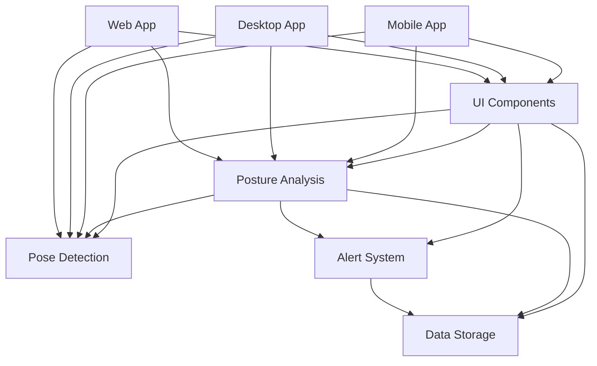

# Module Integration Plan

## Overview

This document outlines the integration strategy for connecting all modules of the posture monitoring application into a cohesive, working system.

## Module Dependencies



## Integration Steps

### Phase 1: Core Integration (Week 1)

#### 1.1 Pose Detection + Posture Analysis

```typescript
// Integration point: PoseProcessor.ts
import { PoseDetector } from '@posture-monitor/pose-detection';
import { PostureAnalyzer } from '@posture-monitor/posture-analysis';

export class PoseProcessor {
  private detector: PoseDetector;
  private analyzer: PostureAnalyzer;
  
  constructor() {
    this.detector = new PoseDetector({
      modelPath: './models/cpm/model.json',
      modelType: 'cpm'
    });
    
    this.analyzer = new PostureAnalyzer({
      enableSmoothing: true
    });
  }
  
  async process(frame: ImageData): Promise<PostureMetrics> {
    const pose = await this.detector.detectPose(frame);
    return this.analyzer.analyzePose(pose);
  }
}
```

#### 1.2 UI Components + Core Modules

```typescript
// Integration: App.tsx
import { PoseCamera, PostureScore, AlertBanner } from '@posture-monitor/ui-components';
import { PoseProcessor } from './services/PoseProcessor';

export const App = () => {
  const processor = new PoseProcessor();
  
  return (
    <View>
      <PoseCamera
        onPoseDetected={(pose) => processor.process(pose)}
      />
      <PostureScore score={metrics.score} />
      <AlertBanner issues={metrics.issues} />
    </View>
  );
};
```

### Phase 2: Alert System Integration (Week 2)

#### 2.1 Alert System + Posture Analysis

```typescript
// AlertIntegration.ts
import { AlertManager } from '@posture-monitor/alerts';
import { PostureMetrics } from '@posture-monitor/posture-analysis';

export class AlertIntegration {
  private alertManager: AlertManager;
  
  processMetrics(metrics: PostureMetrics) {
    // Generate alerts based on posture issues
    metrics.issues.forEach(issue => {
      this.alertManager.triggerAlert({
        type: issue.type,
        severity: issue.severity,
        message: issue.recommendation
      });
    });
  }
}
```

#### 2.2 Platform-Specific Alert Delivery

```typescript
// Mobile alert delivery
import { Notifications } from 'expo-notifications';

export class MobileAlertChannel {
  async sendAlert(alert: Alert) {
    await Notifications.scheduleNotificationAsync({
      content: {
        title: 'Posture Alert',
        body: alert.message,
        sound: true
      },
      trigger: null
    });
  }
}
```

### Phase 3: Data Persistence Integration (Week 3)

#### 3.1 Session Management

```typescript
// SessionManager.ts
import { Database } from '@posture-monitor/data-storage';
import { PostureMetrics } from '@posture-monitor/posture-analysis';

export class SessionManager {
  private db: Database;
  private currentSession: Session | null = null;
  
  async startSession(userId: string) {
    this.currentSession = await this.db.sessions.create({
      userId,
      startTime: new Date(),
      metrics: []
    });
  }
  
  async recordMetrics(metrics: PostureMetrics) {
    if (!this.currentSession) return;
    
    await this.db.metrics.create({
      sessionId: this.currentSession.id,
      ...metrics,
      timestamp: new Date()
    });
  }
}
```

#### 3.2 Analytics Data Pipeline

```typescript
// AnalyticsPipeline.ts
export class AnalyticsPipeline {
  async generateReport(userId: string, timeRange: TimeRange) {
    const sessions = await this.db.sessions.findByUser(userId, timeRange);
    
    return {
      totalTime: this.calculateTotalTime(sessions),
      averageScore: this.calculateAverageScore(sessions),
      topIssues: this.identifyTopIssues(sessions),
      trends: this.calculateTrends(sessions)
    };
  }
}
```

### Phase 4: Cross-Platform Integration (Week 4)

#### 4.1 Shared State Management

```typescript
// StateManager.ts
import { createContext, useContext } from 'react';

interface AppState {
  user: User | null;
  currentSession: Session | null;
  metrics: PostureMetrics | null;
  settings: Settings;
}

const StateContext = createContext<AppState>(null);

export const useAppState = () => useContext(StateContext);
```

#### 4.2 Platform Adapters

```typescript
// PlatformAdapter.ts
export interface PlatformAdapter {
  camera: CameraAdapter;
  storage: StorageAdapter;
  notifications: NotificationAdapter;
}

// Mobile implementation
export class MobilePlatformAdapter implements PlatformAdapter {
  camera = new ExpoCameraAdapter();
  storage = new AsyncStorageAdapter();
  notifications = new ExpoNotificationAdapter();
}

// Desktop implementation
export class DesktopPlatformAdapter implements PlatformAdapter {
  camera = new WebcamAdapter();
  storage = new ElectronStorageAdapter();
  notifications = new ElectronNotificationAdapter();
}
```

## Testing Integration

### Integration Test Suite

```typescript
// integration.test.ts
describe('Module Integration', () => {
  test('Pose Detection -> Posture Analysis', async () => {
    const detector = new PoseDetector({ modelPath: testModelPath });
    const analyzer = new PostureAnalyzer();
    
    const pose = await detector.detectPose(testImage);
    const metrics = analyzer.analyzePose(pose);
    
    expect(metrics.score).toBeDefined();
    expect(metrics.issues).toBeInstanceOf(Array);
  });
  
  test('Posture Analysis -> Alert System', async () => {
    const analyzer = new PostureAnalyzer();
    const alertManager = new AlertManager();
    
    const metrics = analyzer.analyzePose(testPose);
    const alerts = alertManager.generateAlerts(metrics);
    
    expect(alerts.length).toBeGreaterThan(0);
  });
});
```

## Performance Optimization

### 1. Module Loading

```typescript
// Lazy load heavy modules
const PoseDetector = lazy(() => import('@posture-monitor/pose-detection'));
const PostureAnalyzer = lazy(() => import('@posture-monitor/posture-analysis'));
```

### 2. Data Flow Optimization

```typescript
// Use observables for reactive data flow
import { Observable } from 'rxjs';

export class DataFlowManager {
  private poseStream$ = new Subject<Pose>();
  private metricsStream$ = new Subject<PostureMetrics>();
  
  constructor() {
    // Pipeline setup
    this.poseStream$
      .pipe(
        throttleTime(50), // Limit to 20 FPS
        map(pose => this.analyzer.analyzePose(pose)),
        distinctUntilChanged((a, b) => a.score === b.score)
      )
      .subscribe(metrics => this.metricsStream$.next(metrics));
  }
}
```

## Deployment Strategy

### 1. Module Bundling

```javascript
// webpack.config.js
module.exports = {
  entry: {
    'pose-detection': './packages/pose-detection/src/index.ts',
    'posture-analysis': './packages/posture-analysis/src/index.ts',
    'ui-components': './packages/ui-components/src/index.ts'
  },
  optimization: {
    splitChunks: {
      chunks: 'all',
      cacheGroups: {
        tensorflow: {
          test: /[\\/]node_modules[\\/]@tensorflow/,
          name: 'tensorflow',
          priority: 10
        }
      }
    }
  }
};
```

### 2. Progressive Loading

```typescript
// Progressive feature loading
export class FeatureManager {
  async loadCoreFeatures() {
    // Load essential modules first
    await import('@posture-monitor/pose-detection');
    await import('@posture-monitor/ui-components');
  }
  
  async loadAdvancedFeatures() {
    // Load optional features later
    await import('@posture-monitor/analytics');
    await import('@posture-monitor/social');
  }
}
```

## Monitoring Integration Health

```typescript
// HealthCheck.ts
export class IntegrationHealthCheck {
  async checkAllModules(): Promise<HealthReport> {
    const checks = await Promise.all([
      this.checkPoseDetection(),
      this.checkPostureAnalysis(),
      this.checkAlertSystem(),
      this.checkDataStorage()
    ]);
    
    return {
      healthy: checks.every(c => c.healthy),
      modules: checks
    };
  }
}
```

## Troubleshooting Guide

### Common Integration Issues

1. **Module Version Conflicts**
   - Use workspace protocol in package.json
   - Run `npm run build` in monorepo root

2. **Circular Dependencies**
   - Use dependency injection
   - Create interface packages

3. **Performance Bottlenecks**
   - Profile with Chrome DevTools
   - Use React DevTools Profiler

4. **Platform-Specific Issues**
   - Test on all target platforms
   - Use platform adapters

## Next Steps

1. Complete integration testing
2. Performance benchmarking
3. Security audit
4. User acceptance testing
5. Production deployment